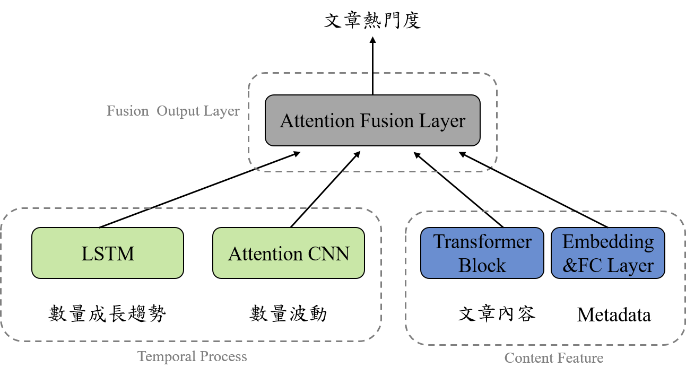

# DFTC on PTT Data

## 模型架構圖

## Features
DFTF模型一共有4種特徵
- 數量成長趨勢
- 數量波動趨勢(cumsum)
- 文章向量特徵
- 文章特徵之向量(post feature)

### 文章特徵之向量(post feature)組成
|特徵|描述|資料型態|
|-|-|-|
|Popular Probability|該作者所發布文章成為熱門文章的機率，熱門數量÷總文章數|float|
|Avg_Comments|平均每篇文章所能獲得的推噓文總數|float|
|Avg_Pos|平均每篇文章所能獲得的推文數|float|
|Avg_Nag|平均每篇文章所能獲得的噓文數|float|
|Publish_Time|文章發布的時間(小時)|int|

